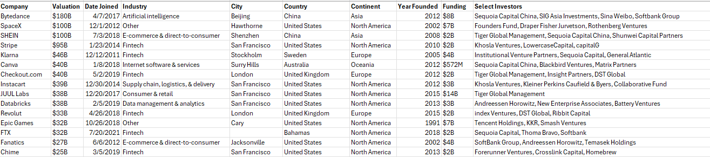
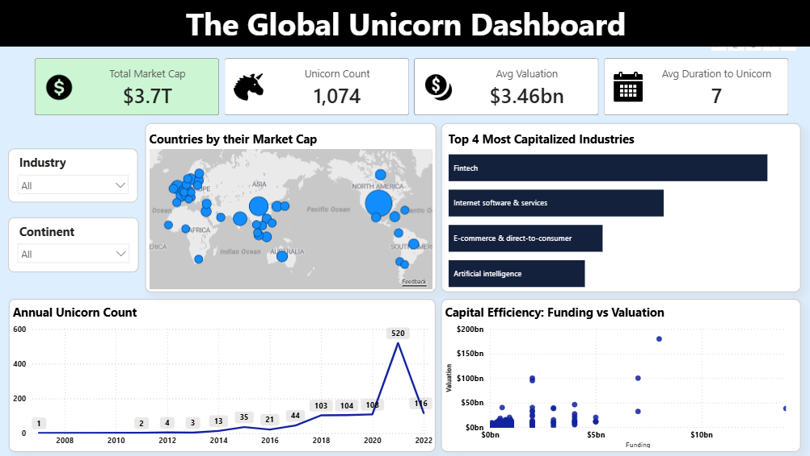

# Global Unicorn Companies Strategic Analysis Report

## Executive Summary
The global unicorn ecosystem represents one of the most compelling investment landscapes in modern history. This report provides a comprehensive analysis of the current state of billion dollar startups across the world, covering market capitalization, industry concentration, geographic distribution and capital efficiency. The findings are drawn from the Global Unicorn Companies Dataset and are designed to equip Senior Partners and Venture Capitalists with the strategic intelligence needed to identify opportunities, allocate capital effectively and navigate the evolving startup landscape.
The data paints a picture of an ecosystem that experienced extraordinary growth, is heavily concentrated in a small number of markets and industries and contains a mix of hyper-efficient companies and capital-intensive underperformers. Understanding where these companies sit on the efficiency spectrum is arguably the most valuable insight this report offers.

## Business Brief
The unicorn ecosystem has grown from a niche concept to a multi-trillion dollar global asset class. For senior investors and venture capital firms, the ability to quickly identify where value is being created, which geographies are leading innovation and which companies are generating returns relative to their funding is no longer a nice-to-have. It is a strategic necessity.
This analysis was commissioned to address that need directly. Using the Global Unicorn Companies Dataset, the dashboard and accompanying report are designed to answer the four most pressing questions facing investors in this space: how large is the total opportunity, where is the money concentrated, which markets are driving growth and which companies are doing the most with the least.

## Objectives
- What is the total value of the global unicorn market and what does the average deal look like?
- Which industries are generating the most wealth and where is capital concentrated?
- Which countries and regions are the dominant hubs for unicorn activity?
- How quickly do these companies typically reach unicorn status and what does that mean for investment timelines?
- Which companies are capital efficient and which are burning through funding without proportionate returns?

## Data Overview
The analysis is based on the Global Unicorn Companies Dataset which contains records of startups that have achieved a valuation of one billion dollars or more. The dataset includes company-level data covering valuation, total funding raised, country of origin, industry classification and continent. This data enables both high-level market analysis and granular company-level efficiency assessment.

## Data Preview

## Analysis and Insights
### The Market at a Glance
The four headline metrics establish the scale and character of the unicorn landscape before any deeper analysis begins.
The total market capitalization of all unicorn companies in the dataset stands at 3.7 trillion dollars. To put that in context, this figure represents the cumulative valuation of private startups that have not yet gone through a public offering. It is a number that underscores just how significant the private market has become as an investment arena.
There are 1,074 unicorn companies in the dataset. This is the total count of opportunities available to investors operating in this space. Each represents a company that has crossed the billion dollar threshold and entered a category that was once considered exceptionally rare.
The average valuation sits at 3.46 billion dollars. While the headline total market cap is dominated by a small number of outliers at the top, this average figure gives investors a more grounded sense of what a typical unicorn deal looks like. It signals that the majority of these companies, while valuable, are not in the same stratosphere as headline names like ByteDance.
Finally the average time for a company to reach unicorn status is 7 years. This metric is critical for investors assessing entry timing and portfolio planning. A 7-year average suggests that patient, long-term capital is the norm in this ecosystem rather than the exception.

### Geographic Concentration
The geographic distribution of unicorn value is highly concentrated, with four countries accounting for the overwhelming majority of total market capitalization.
The United States leads the world by a significant margin with 1.9 trillion dollars in total unicorn market cap. This represents more than half of the global total on its own, which speaks to the depth of the US startup ecosystem, the availability of venture capital and the maturity of institutions that support company scaling from seed to unicorn status.
China holds the second position at 696 billion dollars, a figure that is substantial but sits at roughly one third of the US total. Despite this gap, China's presence in the top two reflects the strength of its technology sector and the scale of its domestic consumer market which has allowed companies like ByteDance to grow to extraordinary valuations.
India ranks third at 196 billion dollars while the United Kingdom comes in at a very close fourth at 195 billion dollars. The near-identical figures between India and the UK are notable. India's position is driven largely by its booming technology and fintech sectors, while the UK's presence reflects London's standing as a global financial and technology hub. The gap between these two and China, however, highlights that the top of the leaderboard is very much a two-country race for now.
For investors, the geographic concentration carries an important implication. Over 80 percent of global unicorn value sits in just four countries. Any portfolio strategy that seeks meaningful exposure to this asset class must have a deliberate position on the US and China specifically.

### Industry Concentration
The ranking of industries by total market capitalization reveals where wealth creation is most concentrated across the unicorn ecosystem.
Fintech leads all industries with a total market cap of 882 billion dollars, making it by far the most valuable sector in the unicorn landscape. The digitization of financial services, the disruption of traditional banking and the global demand for accessible financial products have combined to make fintech the dominant generator of unicorn value. For investors, this sector warrants the closest attention both in terms of opportunity and in terms of competitive saturation.
Internet Software and Services ranks second at 595 billion dollars. This broad category captures the infrastructure of the modern digital economy and its position at number two reflects the foundational role that software platforms play across nearly every industry.
E-commerce and Direct-to-Consumer comes in third at 426 billion dollars. The shift in consumer behavior toward online purchasing, accelerated by the COVID-19 pandemic, has created a wave of high-value companies in this space. The presence of companies like SHEIN in the dataset as a standout efficiency example is consistent with this sector's overall strength.
Artificial Intelligence rounds out the top four at 377 billion dollars. While AI sits fourth today, the trajectory of investment and the rate at which AI companies are entering the unicorn club suggests this figure will grow substantially in the coming years. Investors who are not already building positions in the AI space should treat this as an early signal of where significant future value is likely to concentrate.

### The Annual Unicorn Trend
The historical trend of new unicorns joining the club each year tells the story of a market that went from slow and steady to explosive in a remarkably short window of time.
From 2011 to 2017 the growth in new unicorns was gradual. The dataset shows just 2 new unicorns in 2011, with the number climbing modestly year on year. A slight bump to 35 new unicorns in 2015 was followed by a pullback to 21 in 2016 before recovering to 44 in 2017. Throughout this period the market was growing but the rate of growth was measured and consistent with what could be described as a healthy, sustainable pace of expansion.
The real inflection point came in 2020 when 108 new unicorns entered the club in a single year. This surge likely reflects a combination of factors including low interest rate environments driving capital into risk assets, accelerated digital adoption driven by the pandemic and a wave of technology companies reaching maturity after years of growth.
What followed in 2021 was remarkable by any measure. 520 new unicorns were minted in a single year, representing a 381.5% increase over the 2020 figure and the highest single-year total in the dataset. This number fundamentally changed the character of the unicorn category. What was once a rare designation became, in 2021, something closer to a common milestone for well-funded technology companies.
For investors, this trend raises important questions. A market that grows 381.5% in a single year is not growing organically. It is responding to external conditions, primarily the availability of cheap capital. As interest rates have since risen and the macroeconomic environment has tightened, the sustainability of the 2021 pace is the central question any forward-looking investor must grapple with.

### Capital Efficiency
The analysis of funding raised versus current valuation is where the most actionable investor intelligence in this report sits. The scatter plot reveals four distinct categories of companies and the differences between them have direct implications for investment strategy.
JUUL Labs represents the clearest example of capital inefficiency in the dataset. The US-based company has raised 14 billion dollars in funding but carries a current valuation of just 38 billion dollars. While a 38 billion dollar valuation is not trivial, the ratio of funding to valuation tells a concerning story. JUUL Labs has consumed an enormous amount of capital to reach its current value, which signals either significant operational challenges, a difficult regulatory environment or both. For investors this is a classic capital-burning profile and warrants caution.
ByteDance sits at the opposite extreme and represents the gold standard of what success looks like in this dataset. The Chinese company behind TikTok has raised 8 billion dollars in funding and carries a valuation of 180 billion dollars. That is a valuation-to-funding multiple of over 22 times. ByteDance falls squarely into the well-funded giants category, a company with both high funding and exceptional valuation that has clearly deployed its capital with outstanding effectiveness.
SHEIN and Stripe represent the most compelling category for investors: the best performers. SHEIN has raised approximately 2 billion dollars and carries a valuation of 100 billion dollars, a multiple of 50 times its funding. Stripe has raised a similar amount, approximately 2 billion dollars, and is valued at 95 billion dollars. These two companies have achieved massive scale and valuation on a fraction of the capital that less efficient peers have consumed. For investors, companies in this category represent the ideal profile: disciplined capital deployment with outsized returns.
The majority of companies in the dataset cluster in the bottom left of the scatter plot, which reflects low funding and low valuation. This is not necessarily a negative signal. Companies in this cluster are most likely in the early stages of their growth journey and it is genuinely too early to determine whether they will scale toward the SHEIN and Stripe end of the spectrum or stall out. What this cluster tells investors is that the unicorn label alone is not sufficient grounds for investment. The designation simply means a company has crossed the billion dollar threshold, not that it has demonstrated the capital efficiency that separates good investments from great ones.

## Dashboard

Click the link to interact with the live dashbaord
[Click here](https://app.powerbi.com/view?r=eyJrIjoiMzgxYWMwYWMtM2U1Mi00N2VjLWE1MGQtMzE1NGU1MGE1ZmUyIiwidCI6IjZjNzQ3Mzg1LTUyNTktNDcwMS05MTkzLTc5ZTkxNWNlYjA3ZSJ9)

## Recommendations
The findings across all five areas of analysis point to four strategic recommendations for senior investors operating in the unicorn space.
The geographic concentration of value in the United States and China means that any serious investment strategy must have a clearly defined position on both markets. Avoiding them entirely is not a neutral decision, it is a decision to step aside from over 70 percent of total market value. For investors with risk appetite, India and the UK represent the most credible emerging alternatives with India's trajectory suggesting it could close the gap on China over the next decade.
The surge in unicorn creation in 2021 should be treated as a data point that requires context rather than a baseline to project from. The conditions that produced 520 new unicorns in a single year were extraordinary and unlikely to repeat in the near term. Investors should calibrate expectations accordingly and focus on quality of opportunity rather than volume.
Capital efficiency should be a primary screening criterion in investment decisions. The dataset demonstrates clearly that valuation alone tells an incomplete story. A company valued at 38 billion dollars that has consumed 14 billion in funding is a fundamentally different proposition than a company valued at 100 billion dollars that has raised 2 billion. Building a simple funding-to-valuation ratio into the initial screening process would immediately improve the quality of the opportunity pipeline.
Finally, the growth of Artificial Intelligence as the fourth largest sector by total unicorn market cap, combined with the pace at which AI companies are entering the ecosystem, makes it the sector most likely to challenge Fintech's dominance in the medium term. Investors who are not already building positions in AI unicorns should treat this as an early signal rather than wait for the trend to become consensus.

## Limitations
The dataset captures valuation at a point in time and private company valuations are inherently less reliable than public market prices. They are set during funding rounds and can reflect investor sentiment as much as underlying business performance. The analysis of capital efficiency in particular should be read with this in mind.
The dataset does not include companies that attempted to reach unicorn status and failed. This survivorship bias means the landscape presented here is inherently more positive than the full picture of startup outcomes would suggest.
There is no revenue or profitability data in the dataset. Valuation and funding figures can identify efficient companies in relative terms but they cannot confirm whether a company is generating sustainable returns. A company with a high valuation-to-funding ratio is efficient by this measure but may still be loss-making.

## Conclusion
The global unicorn ecosystem represents a 3.7 trillion dollar opportunity that is concentrated, fast-moving and highly differentiated in terms of the quality of companies within it. The United States and China dominate by geography, Fintech and Internet Software lead by industry and the 2021 boom fundamentally reshaped the scale and character of the market. Most importantly, the capital efficiency analysis makes clear that the unicorn label is a starting point for evaluation and not an endpoint. The companies that matter most to serious investors are those that have built extraordinary value on disciplined capital, and in this dataset those companies do exist. Finding more of them, earlier, is the central challenge and opportunity this market presents.
